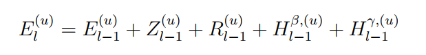
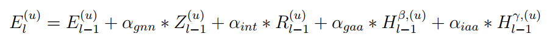
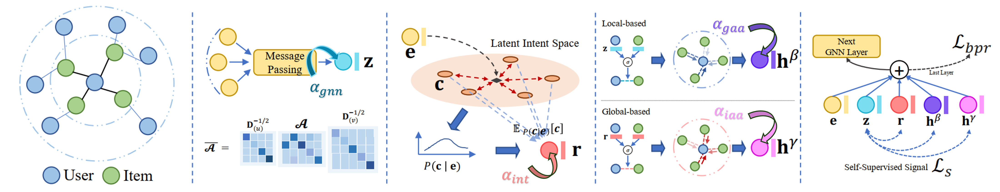
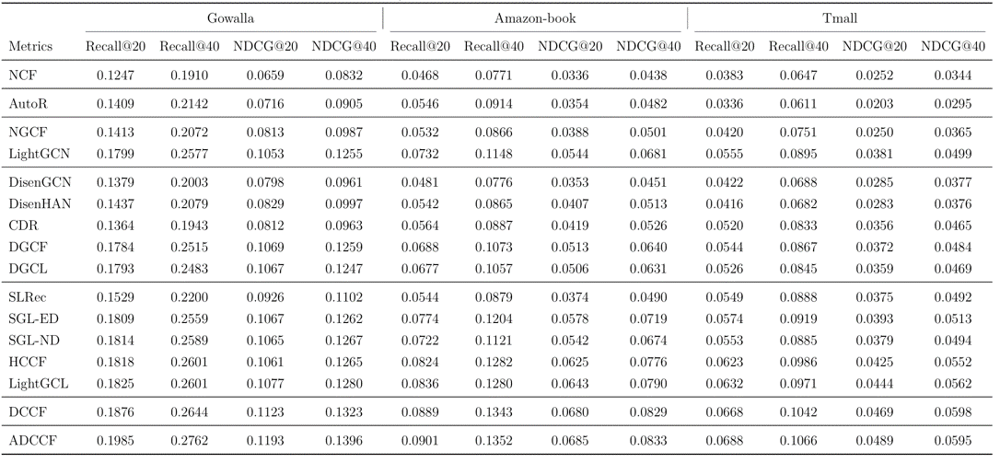
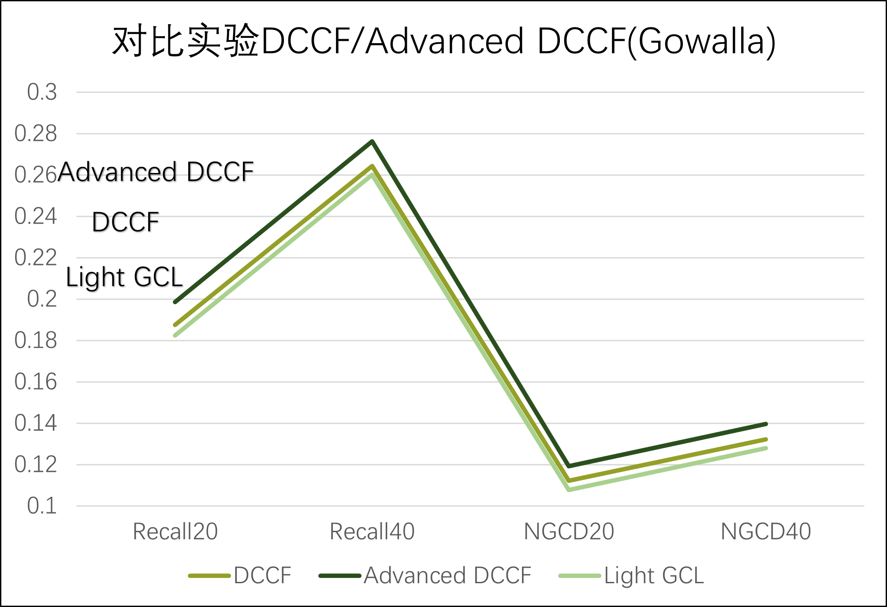

# 改进的分离对比协同过滤

这是基于 Disentangled Contrastive Collaborative Filtering(DCCF) 模型进行的改进

 >**Disentangled Contrastive Collaborative Filtering**  
 > Xubin Ren, Lianghao Xia, Jiashu Zhao, Dawei Yin, Chao Huang*\
 >*SIGIR 2023*

是我们提出的 Advanced DCCF 模型的 PyTorch 实现

## 作者

[Yupeng Zhang](https://github.com/SYSU-Zhangyp)

[Shuaixuan Liang]()

## 开发环境

### 服务器配置

GPU：RTX 3090(24GB)

CPU：14 vCPU Intel(R) Xeon(R) Platinum 8362 CPU @ 2.80GHz

PyTorch  1.11.0，Python  3.8(ubuntu20.04)，Cuda  11.3

### 环境依赖

代码编写是基于 Python 3.8.13 的下列依赖 

- numpy == 1.22.3
- pytorch == 1.11.0 (GPU version)
- torch-scatter == 2.0.9
- torch-sparse == 0.6.14
- scipy == 1.9.3

## 模型创新

### DCCF 模型
Ren 等提出的这种分离对比学习方法，深入探讨了交互隐含意图的潜在因素。通过引入图结构学习层，基于学习的分离用户 (物品) 意图感知依赖来实现自适应的交互增强。

沿着增强的意图感知图结构的研究方向，他们又使用了意图感知的对比学习方案，使得模型的鲁棒性、稳定性得到提升，并且一定程度上也提高模型的可解释性。

通过作者广泛的对比实验，验证了 DCCF 模型在不同的推荐数据集上的有效性，为推荐系统领域引入了一种新的思路，即通过意图感知和对比学习来优化模型，从而在实际应用中取得了显著的进展和成果。

### Advanced DCCF 模型

我们认为这个模型可能还存在有可改进的方向，在分离对比学习的过程中，原模型对于每个信息传递矩阵的关注程度都是相同的，意味着模型对每个信息在编码隐式关系和进行对比学习时的重视程度是相同的。

在原模型中，每层的图神经网络消息传递是由四个部分直接相加得到的：基本信息
传递、意图嵌入消息传递、自适应增强信息传递和自适应增强意图嵌入消息传递。

我们认为这种直接相加的方式略显粗糙，因为它默认了这四个部分的重要性都相等。我们认为这种固定权重可能会影响模型的表征能力。

<p align="center">

</p>

因此，在 Advanced-DCCF 中，我们为基本信息传递、意图嵌入消息传递、自适应增强信息传递和自适应增强意图嵌入消息传递这四部分引入了可学习的权重系数： α_gnn、α_int、 α_gaa、 α_iaa。

这一创新的做法允许模型根据数据的特性和任务的要求动态地调整每个部分的贡献度，从而更精细地调控信息传递过程中的重要性和影响力。

<p align="center">

</p>

原理如下。
<p align="center">

</p>

##  数据集

我们使用了开源的三个数据集进行评估 Advanced DCCF:  *Gowalla, Amazon-book,* and *Tmall*. 

在这个上下文中，验证集仅用于调整超参数，而对于Gowalla和Tmall数据集，验证集会在训练时与训练集合并使用。

## 训练测试

### 下载包
从 Github 下载包

```shell
git clone https://github.com/SYSU-Zhangyp/Advanced-DCCF-main.git
```

### 训练举例

训练 DCCF on the Gowalla / Amazon-book / Tmall 数据集的命令如下。

训练 Advanced 需要灵活调整 epoch 的大小，并且测试结果保存到了 log 文件夹中。

  - Gowalla 

    ```shell
    python DCCF_PyTorch.py --dataset gowalla --epoch 200
    ```   

  - Amazon-book:

    ```shell
    python DCCF_PyTorch.py --dataset amazon --epoch 100
    ```

  - Tmall:

    ```shell
    python DCCF_PyTorch.py --dataset tmall --epoch 100
    ```

## 结果展示

<p align="center">

</p>

我们的 Advanced DCCF 模型在 Gowalla 数据集上改进表现最好，在四个评估指标上的平均改进比为 5.5%，最高的改进比是 NDCG@20 的 6.3%。

下图展示了对比实验中 Advanced DCCF 与 DCCF 和 Light GCL 的召回率和标准化折损累积增益上的差异。

一般来说，召回率越高，标准化折损累积增益越高，推荐模型的推荐效果就越好。

<p align="center">

</p>
